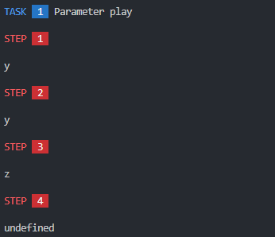

Quest Runner
============

This is a remote API testing tool that uses **JavaScript** language and **nodeJS** as a runtime environment.

Unlike creating request and response configurations in any of the popular API testing tools, here the test scenario script contains code that calls relevant requests to the API and checks the results. 

If possible, the scenario code can be kept simple so that it is easily readable by another programmer.

The scenario code is unlikely to be suitable in this form for those not familiar with the technical side of API communication.

It is also possible to conditionally skip steps or follow an alternative process path, which can also be useful.

> Please consider following this project's author [Filip Golewski](https://github.com/zoltraks) and ⭐ the [project](https://github.com/zoltraks/quest-runner) to show your ❤️ and support. 

## Install ##

Install with [npm](https://www.npmjs.com/) in current directory:

```sh
$ npm install quest-runner
``` 

This tool depends on several [npm](https://www.npmjs.com/) packages like ``yargs``, ``ansi-colors``, ``color-support``. 

Required packages will be also installed.

## Scenario ##

Create ``my.quest.js`` file in your current directory.

```js
task(() => {

    step(x => x.result('Hello, World!'));

});
```

This is the minimal task with only one step.

```
npx quest-runner
```

By running this command it will look for first file which name ends with ``.quest.js`` in current directory.

You should see results of running this simple scenario. 


If you have more than one file which name ends with ``.quest.js``, you may specify file that should be used by quest-runner.

```
npx quest-runner run my.quest.js
```

You can omit ``.quest.js`` filename extension. 

```
npx quest-runner run my
```

If all steps succeeds return code will be ``0`` (success).

If any step fails return code ``$?`` in bash for example will be ``1``.

```
npx quest-runner list
```

List steps to take in order they are specified in scenario script.

## Command line usage ##

Using ``npx quest-runner`` you can use several options.

To see all options execute ``npx quest-runner --help``.

```
Options:
      --skip     Specify task to skip                                    [array]
      --task     Specify task to execute                                 [array]
      --silent   Silent mode                                           [boolean]
      --draw     Draw execution diagram                                [boolean]
  -V, --version  Show version number                                   [boolean]
  -?, --help     Show help                                             [boolean]
  -v, --verbose  Verbose mode                                          [boolean]
```

To run specified task (one or more) and skip all other without ``always`` flag use ``--task`` parameter.

You may use it more than once to specify more tasks to be run.

```
npx quest-runner --task "Task 1" --task "Task 3"
```

To skip one or more tasks use ``--skip`` parameter.

```
npx quest-runner --skip "Task 2"
```

If using ``--skip`` and ``--task`` with the same name, skip takes precedence.

Task names used in ``--task`` and ``--skip`` parameters are case insensitive.

## Code linting ##

If you use [eslint](https://eslint.org) then you can add ``task``, ``step`` and optionally ``play`` functions to your globals in ``.eslintrc.json``.

```json
{
    "rules": {

        "globals": {
            "play": "readonly",
            "task": "readonly",
            "step": "readonly"
        }

    }
}
```

## Advanced examples ##

Let's create network ping example in ``ping.quest.js``.

```js
task(' ', () => {

    step('Check Google', x => {
        x.expectAlive('google.com', { print: true });
    })

})
```


In case ping fails task will also fail and extra information would be printed.

```js
task(' ', () => {

    step('Alive error', x => {
        x.expectAlive('host-at.non-existing-domain', { print: true });
    })

})
```


If you want to debug your scenario in JavaScript Debug Terminal you may need to add additional code to execute runner directly from ``.quest.js`` script file.

This step is optional.

```js
const { task, step, play } = require('quest-runner');
```

```js
task(() => {

    step(x => x.result('Hello, World!'));

});
```

```js
play().then(result => result.draw() || result.print());
```

This way you may start runner directly with ``node my.quest.js`` and debug it.

It is still compatible with ``npx quest-runner`` command as it honours when scenario script directly invokes ``play()``.

Also this solution it is compatible with ``nodemon`` utility so it will restart every time you changes in scenario script are saved.

```
nodemon my.quest.js
```

This way you can pass additional options or change how results will be presented.

```js
const { task, step, play } = require('quest-runner');

task(() => {

    step(x => x.result('Hello, World!'));

});

play().then(result => result.print());
```

Even simple ``play()`` will do if you don't care about summary.

As mentioned before, this step is optional and meant to be used mainly for debugging reasons.

In other cases, a simple script with one or more ``task`` and ``step`` declarations is enough.

To make HTTP request use ``x.call()``.

Headers can be specified separately using ``x.setHeader()``.

To clear header simply use ``x.setHeader('User-Agent');`` without specyfing value for header.

Let's put some simple step to check how setting headers for future requests works.

Headers specified as parameter for ``x.call()`` will override headers specified by ``x.setHeader()``.

```js
task(() => {
    
    step(x => {
        const headers = {
            'X-Random': x.getRandomInteger(100, 999),
        };
        const options = {
            timeout: 3000,
        };
        x.call(
            'GET',                      // HTTP method to use (GET, PUT, POST, DELETE)
            'https://www.google.com/',  // Endpoint URL address
            false,                      // Request body (payload)
            headers,                    // Request headers
            options,                    // Additional options
        );
        let summary = x.getSummary();
        summary.response = x.limit(summary.response, 100, '...');
        x.result(summary);
    });

});
```


```js
task(() => {

    step('Custom header check', x => {
        x.assertNotNull(x.getHeader('X-ABC'));
        x.setHeader('X-ABC', 'ZZZ');
        x.assertNotNull(x.getHeader('x-abc'));
        x.result('getHeader: ' + x.getHeader('x-ABC'));
        x.setHeader('X-ABC');
        x.assertEmpty(x.getHeader('X-ABC'));
        x.result('getHeader: ' + x.getHeader('x-ABC'));
    });

});
```

In this case test will finish with result output of ``x.getHeader()``.


List of defined headers can be obtained by ``x.getHeaders()``.

Simple checks are achieved with ``x.assert*()`` functions which are basic operations that work with any code.

```js
task(() => {

    step(x => {
        x.assertTrue(1 == '1');    // must be true
        x.assertFalse(1 === '1');  // must be false
    });

});
```

During step execution it is possible to specify which step should be taken next, overriding sequential step execution in order they are defined.

All API functions including ``x.call()`` and ``x.expect*()`` are synchronous. No ``async`` or ``await`` needed.

```js
task(() => {

    step(async x => {
        x.assertTrue(undefined == null);    // must be false
        x.assertFalse(undefined === null);  // must be false
        x.assertNull(undefined);            // undefined is null
        x.result('Even when await is not needed it will still work');
    });

});
```

Making HTTP calls is simplified to one generic function ``x.call()``.

This function takes five arguments which are in order:

 - ``method`` which must be valid HTTP method like 'GET', 'POST', etc.
 - ``url`` remote endpoint address, can be relative if base address was set with ``x.setBase()``
 - ``payload`` string or object which will be then represented as JSON string
 - ``headers`` dictionary of additional headers
 - ``options`` used to specify additional connection settings

First two parameters ``method`` and ``url`` are required.

HTTP requests are made using ``curl`` via synchronous execution.

```js
task(() => step(x => x.result(x.call('GET', 'https://www.google.com'))));
```

Additional options may be passed like ``timeout`` or ``keepAlive``.

To bypass self signed certificate you may set ``rejectUnauthorized`` to ``false``.

```js
task(() => {

    step(x => {
        x.result(x.call(
            'GET', 'https://placeholder.alyx.pl:6502',
            null, null, { rejectUnauthorized: false }));
    });

});
```

Using self signed certificates is not good practice.

However, you can globally allow insecure connections by setting `INSECURE` environment variable to `1`, `TRUE` or `YES`.

```sh
export INSECURE=1
```

Result of last ``x.call()`` can be taken using ``x.getResponse()``.

Result of ``x.call()`` is an object containing request ``url`` and ``method`` as well as ``payload`` and ``headers`` in ``request`` and response ``data``, ``headers`` and HTTP ``status`` code. If any error occurs, message will be left in ``error`` field.

For logging you may want to filter request and response by removing headers and request from response.

Or you can use summary object from ``x.getSummary()``.

```js
task(() => {

    step(x => {
        x.call('GET', 'https://jsonplaceholder.typicode.com/posts/1');
        x.result(x.getSummary());
    });

    step(x => {
        x.call('POST', 'https://jsonplaceholder.typicode.com/posts', { key: 'value' });
        x.result(x.getSummary());
    });

});
```

```json
{
    "url": "https://jsonplaceholder.typicode.com/posts/1",
    "method": "GET",
    "time": 176,
    "response": {
        "userId": 1,
        "id": 1,
        "title": "sunt aut facere repellat provident occaecati excepturi optio reprehenderit",
        "body": "quia et suscipit\nsuscipit recusandae consequuntur expedita et cum\nreprehenderit molestiae ut ut quas totam\nnostrum rerum est autem sunt rem eveniet architecto"
    },
    "status": 200
}
```

```json
{
    "url": "https://jsonplaceholder.typicode.com/posts",
    "method": "POST",
    "request": {
        "key": "value"
    },
    "time": 438,
    "response": {
        "key": "value",
        "id": 101
    },
    "status": 201
}
```

In summary you will notice there is ``time`` field which indicates time taken in milliseconds.

If you want to use ``x.getResponse()`` and ``x.getRequest()`` after ``x.call()`` for logging instead
you will probably get lot of data as both HTTP request and response contain array of headers.

```js
task(() => {

    step(x => {
        x.call('GET', 'https://jsonplaceholder.typicode.com/posts/1');
        x.result(x.getRequest());
        x.result({ ...x.getResponse(), request: undefined, headers: undefined });
    });

});
```

```json
{
    "url": "https://jsonplaceholder.typicode.com/posts/1",
    "method": "GET",
    "headers": {
        "Accept": "application/json, text/plain, */*",
        "User-Agent": "quest-runner/1.0",
        "Accept-Encoding": "gzip, compress, deflate, br"
    }
}
```

```json
{
    "url": "https://jsonplaceholder.typicode.com/posts/1",
    "method": "GET",
    "data": {
        "userId": 1,
        "id": 1,
        "title": "sunt aut facere repellat provident occaecati excepturi optio reprehenderit",
        "body": "quia et suscipit\nsuscipit recusandae consequuntur expedita et cum\nreprehenderit molestiae ut ut quas totam\nnostrum rerum est autem sunt rem eveniet architecto"
    },
    "status": 200
}
```

If you dump object returned by ``x.getResponse()`` you will see all data related to last ``x.call()``.

```js
task(() => {

    step(x => {
        x.call('GET', 'https://jsonplaceholder.typicode.com/posts/1');
        x.result(x.getResponse());
    });

});
```

```json
{
    "url": "https://jsonplaceholder.typicode.com/posts/1",
    "method": "GET",
    "request": {
        "headers": {
            "Accept": "application/json, text/plain, */*",
            "User-Agent": "quest-runner/1.0",
            "Accept-Encoding": "gzip, compress, deflate, br"
        }
    },
    "headers": {
        "date": "Thu, 25 Jul 2024 08:48:08 GMT",
        "content-type": "application/json; charset=utf-8",
        "transfer-encoding": "chunked",
        "connection": "close",
        "x-powered-by": "Express",
        "vary": "Origin, Accept-Encoding",
        "access-control-allow-credentials": "true",
        "cache-control": "max-age=43200",
        "pragma": "no-cache",
        "expires": "-1",
        "x-content-type-options": "nosniff",
        "etag": "W/\"124-yiKdLzqO5gfBrJFrcdJ8Yq0LGnU\"",
        "via": "1.1 vegur",
        "cf-cache-status": "HIT",
        "age": "7600",
        "server": "cloudflare",
        "alt-svc": "h3=\":443\"; ma=86400"
    },
    "data": {
        "userId": 1,
        "id": 1,
        "title": "sunt aut facere repellat provident occaecati excepturi optio reprehenderit",
        "body": "quia et suscipit\nsuscipit recusandae consequuntur expedita et cum\nreprehenderit molestiae ut ut quas totam\nnostrum rerum est autem sunt rem eveniet architecto"
    },
    "status": 200
}
```

There is separate request information from last ``x.call()`` available at ``x.getRequest()``.

Sometimes you don't care about request and response headers. 

You may easily filter them out using simple JavaScript object deconstruction.

```js
task(() => {

    step(x => {
        x.call(
            'POST',
            `https://jsonplaceholder.typicode.com/posts`,
            {
                title: 'foo',
                body: 'bar',
                userId: 1,
            }
        );
        x.result({ ...x.getRequest(), headers: undefined});
        x.result({ ...x.getResponse(), request: undefined, headers: undefined });
    });

});
```

```json
{
    "url": "https://jsonplaceholder.typicode.com/posts",
    "method": "POST",
    "payload": {
        "title": "foo",
        "body": "bar",
        "userId": 1
    }
}
```

```json
{
    "url": "https://jsonplaceholder.typicode.com/posts",
    "method": "POST",
    "data": {
        "title": "foo",
        "body": "bar",
        "userId": 1,
        "id": 101
    },
    "status": 201
}
```

By default if an error occurs during HTTP request made by ``x.call()`` exception will be thrown and test will fail immediately.

```js
task(() => {

    step(x => x.setTimeout(300) || x.call('GET', 'stupid.local'));

});
```

```
ERROR timeout of 300ms exceeded
```

But you can choose to ignore connection errors by setting ``ignore`` options to ``true``. Error will still be available in response ``error`` field. 

```js
task(() => {

    step(x => {
        x.setTimeout(500);
        x.call('GET', 'stupid.local', undefined, undefined, { ignore: true });
        x.assertEmpty(x.getResponse().error);
    });

});
```

```
CALL GET https://stupid.local

ERROR timeout of 500ms exceeded

Assertion Empty failed for "timeout of 500ms exceeded"
```

To store information that will be available for other steps you can use ``x.setParameter()`` and ``x.getParameter()`` functions.

Parameter names as well as HTTP headers are case insensitive.

Parameters are stored globally and available through all tasks.

```js
task('Parameter play', () => {

    step(x => {
        x.setParameter('x', 'y');
        x.print(x.getParameter('x'));
    });

    step(x => {
        x.print(x.getParameter('X'));  // names are case insensitive
        x.setParameter('X', 'z');
    });

    step(x => {
        x.print(x.getParameter('x'));
        x.setParameter('X');           // this will remove parameter
    });

    step(x => {
        x.print(x.getParameter('x') ?? 'undefined');
    });

});
```



Use parameters for storing authorization tokens and other values needed by sequential API calls.

Parameters exists only in its own ``task``.

Use ``x.next()`` to specify which step should be taken next after current step.

This function takes string argument with step name or one of its aliases.

When declaring step you can specify additional aliases if you want to keep name changeble or empty.

```js
task('Remote API check', () => {

    step('GOTO 365', x => x.next('365'));

    step(x => x.stop('Should not reach this step'));

    step(['', '365'], x => x.stop('Stopped on 365'));

});
```

As you can see, last step has empty name ``''`` but is still reachable by ``next`` function by '365' because it has additional alias set. 

```js
task('Using next', () => {

    step(x => x.next('no future'));

});
```

In case step could not be found, execution will be aborted with message ``Step not found. Missing "no future".``.

Tasks can be easy disabled by setting additional property ``skip`` to ``true``.

```js
task(() => {

}, { skip: true });
```

When using the ``--task`` command line option (which is not yet supported, sorry, next time),
not only the specified task will be started, even if it has the ``skip`` option set to ``true``,
but also all tasks that have the ``always`` option set to ``true``.

```js
task(() => {

    step('Initialization', null);

}, { always: true });

task(() => {

    step('Finalization', null);

}, { always: true });
```

Also steps can be left unnamed, have several names or duplicate names.

You might want to use empty names in some cases.

```js
task(() => {

    step('', () => {});

    step(['', 'not empty alias', 'STEP-XXX'], () => {});

};
```

Having multiple step aliases may be handy for ``x.next()``.

Step code can be left empty but you need to pass ``null`` as second argument otherwise first argument will be treated as code source.

```js
task(() => {

    step('No code at all', null);

    step('console.log(`Hello, World.`);');

});
```

For initial settings like base URL for API calls you may use ``BASE_URL`` environment variable or ``step`` code to initialize it.

```js
task(() => {

    step('', x => process.env.BASE_URL || x.setBase('http://localhost:8080'), { type: 'start' });

});
```

Once base URL is set, it will remain for other tasks.

## Initialization and finalization ##

As mentioned before, parameters are shared between tasks, so we can use them to separate initialization and finalization (cleanup) sections of scenario.

```js
task('Initialize', () => {

    step(x => {
        x.setBase(process.env.BASE_URL ?? 'https://jsonplaceholder.typicode.com/');
    });

});

task('Work', () => {

    step(x => {
        x.call('POST', '/posts');
        x.result(x.getSummary());
        x.setParameter('X-Id', x.getResponse().data.id);
    });

});

task('Finalize', () => {

    step(x => {
        if (x.getParameter('X-Id')) {
            x.call('DELETE', `/posts/${x.getParameter('X-Id')}`);
            x.result(x.getSummary());
        }
    });

});
```


This way even if erorr occurs and exception is thrown in one task, it is still possible to do some cleanup stuff in different task.

## Assertions and expectancy ##

Below is a simple list of ``x.assert*()`` and ``x.expect*()`` functions to be used in scenario code.

Last parameter ``message`` is optional and will be printed instead of default information.

| | |
|-|-|
| ``x.assertTrue(subject, message)``            | Require subject to be ``true``                        |
| ``x.assertFalse(subject, message)``           | Require subject to be ``false``                       |
| ``x.assertNull(subject, message)``            | Require subject to be ``null`` or ``undefined``       |
| ``x.assertNotNull(subject, message)``         | Require subject not to be ``null`` or ``undefined``   |
| ``x.assertEmpty(subject, message)``           | Require subject to be empty                           |
| ``x.assertNotEmpty(subject, message)``        | Require subject not to be empty                       |
| ``x.assertEquals(check, value, message)``     | Require value to be equal to check                    |
| ``x.assertNotEquals(check, value, message)``  | Require value not not to be equal to check            |
| | |
| ``x.expectAny([...], message)``               | Require at least one of check to not throw exception  |
| ``x.expectAll([...], message)``               | Require all of checks not to throw exception          |
| | |
| ``x.expectAlive(subject)``                    | Require host to be alive (ping test)                  |

You may wonder at first sight what is the sense of wrapping checks by ``x.expectAll()``.

In normal case if ``x.assert*()`` fails it stops the step and test entirely.

When wrapped around ``x.expectAll()`` it will allow other steps to be checked as well.

```js
task(() => {

    step(x => {
        x.expectAll([
            x => x.assertTrue(false),
            x => x.assertFalse(true),
        ]);
    });

});
```


All ``x.expect*()`` functions are synchronous.

```js
task(() => {

    step(x => {
        x.expectAny([
            x => x.assertTrue(false),
            x => x.assertFalse(true),
        ]);
    });

});
```


Mixed conditions with HTTP calls are also supported.

```js

task(() => {

    step(x => {
        x.expectAny([
            x => x.call('GET', 'google.com'),
            x => x.assertFalse(true),
        ]);
    });

});
```


## Utility functions ##

Print out current time without date part.

```js
x.time();
```

Current time is returned so you can store it in variable.

You can also omit printing time passing option ``silent`` set to ``true``.

```js
const time = x.time({ silent: true });
x.print(time);
```

Print "Press Enter to continue..." and wait for user to press enter key.

```js
await x.pause();
```

Customize pause message by passing string as function argument.

```js
await x.pause('Enter anything... ');
```

You can pass number of seconds as ``time`` options to set timeout and continue even if user doesn't enter anything.

```js
await x.pause({ time: 3 });
```

Combine options as function parameter customizing text and setting timeout.

```js
await x.pause({ text: 'Wait 3 seconds or press enter...', time: 3 });
```

## Environment variables ##

```
C:> set HIDE_STEP_NAME=1
```

```
PS > $Env:HIDE_STEP_NAME=1
```

### ``BASE_URL`` ###

When set it will be used as initial value for base address for API calls.

### ``HIDE_START_TIME`` ###

When set to ``1`` start time will not be displayed in results.

### ``HIDE_STEP_NAME`` ###

When set to ``1`` step name will remain hidden in results.

### ``HIDE_STEP_RESULT`` ###

When set to ``1`` step result will remain hidden in results.

### ``HIDE_STEP_ERROR`` ###

When set to ``1`` step error will remain hidden in results.

### ``SIZE_STEP_NAME`` ###

Step name size limit. Default is 40.

## Author ##

**Filip Golewski**

* [GitHub Profile](https://github.com/zoltraks)

* [LinkedIn Profile](https://www.linkedin.com/in/filipgolewski)

## License ##

Copyright © 2024-2026 [Filip Golewski](https://github.com/zoltraks).

Released under the [MIT License](LICENSE).
